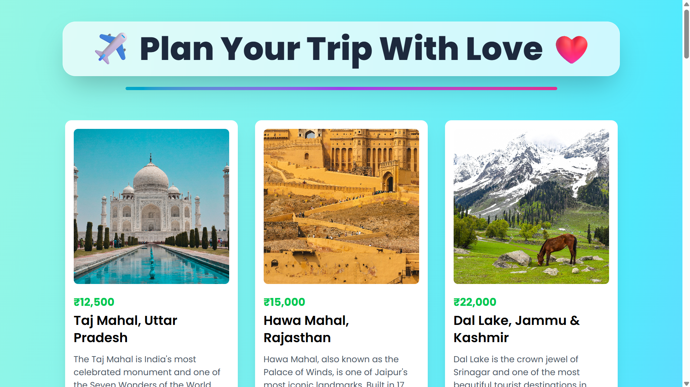
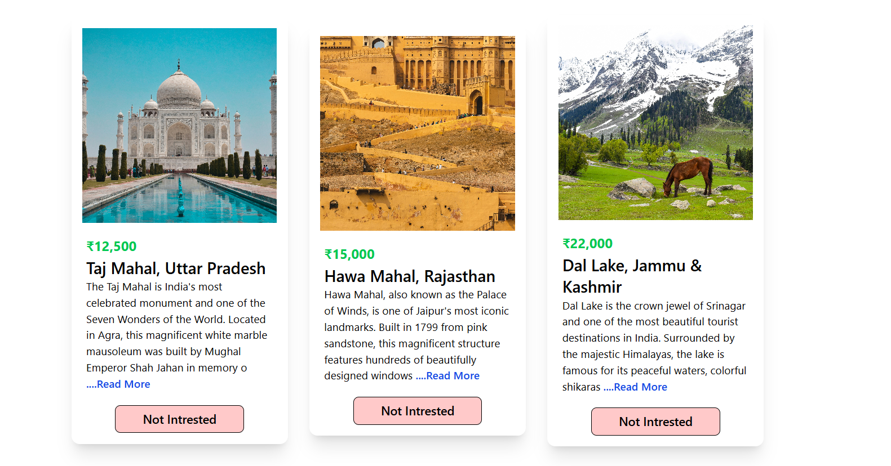
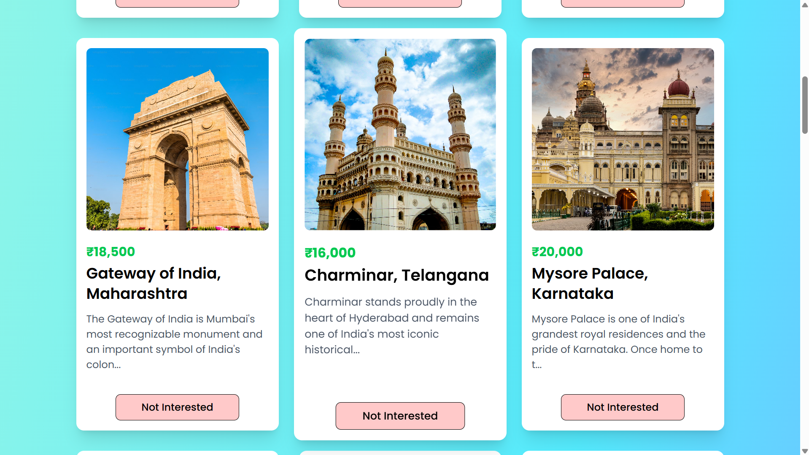
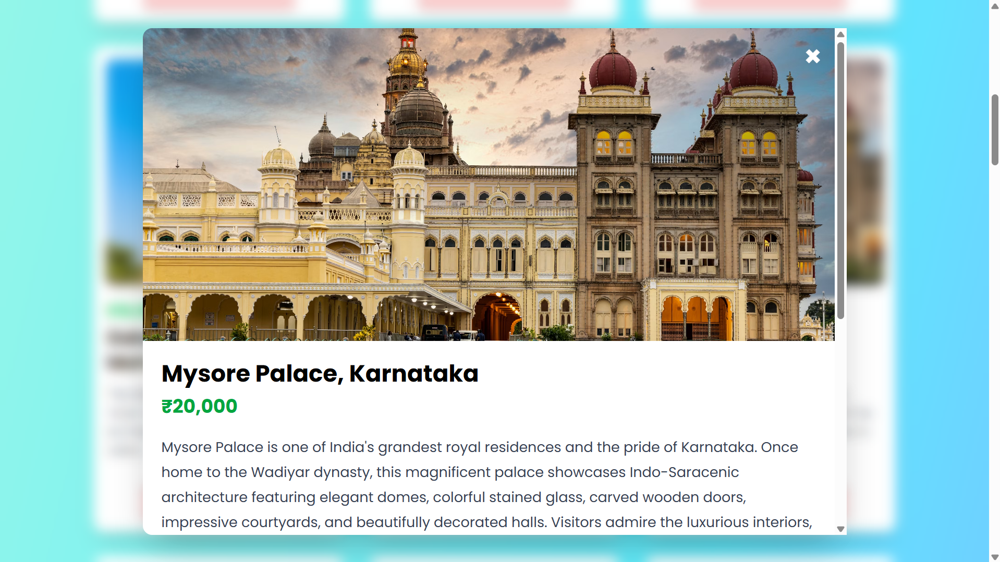
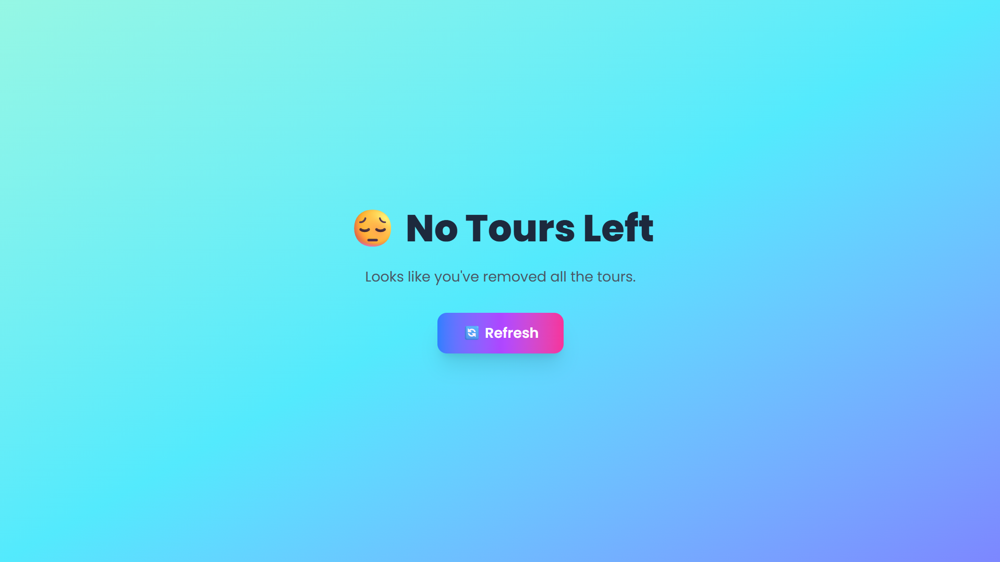

# ✈️ Plan With Love

<p align="center">
  <strong>
    A beautiful React travel planner built to explore destinations,
    inspect trip details, and remove tours you are not interested in.
  </strong>
</p>

<p align="center">
  <a href="https://github.com/adityak71/plan-your-tour-with-love">GitHub Repo</a> •
  <a href="https://plan-your-tour-with-love.vercel.app">Live Demo</a>
</p>

<p align="center">
  
  
  
</p>

---

## About The Project

Plan With Love is a responsive travel card experience built with React and Vite. It presents a collection of Indian destinations as visually rich tour cards, lets the user open a modal for full destination details, and supports removing cards from the list when they are no longer interested.

This project was made as a practical learning exercise to understand component-based UI development, state handling, conditional rendering, list rendering from data, and interaction design with Tailwind CSS utility classes.

## What I Learned

This project helped me practice:

- Breaking a UI into reusable React components.
- Passing data through props instead of hardcoding every card.
- Using `useState` for local component state.
- Filtering arrays to remove an item from the UI.
- Preventing event bubbling with `stopPropagation()`.
- Showing and hiding a modal with conditional rendering.
- Building a polished responsive layout using Tailwind CSS.
- Organizing project data in a separate file for cleaner code.

## How It Is Made

The app follows a simple but effective component flow:

1. `src/data/data.jsx` stores all travel destinations as an array of objects.
2. `App.jsx` loads the data into state and manages the remove/reset logic.
3. `Tours.jsx` renders the page heading and maps the data into card components.
4. `ToursCard.jsx` displays each destination and opens a modal when clicked.
5. `TourModal.jsx` shows the full destination information in an overlay.

The whole UI is built with React + Vite and styled mostly with Tailwind CSS utility classes. The background gradients, rounded cards, shadows, blur overlays, and hover effects are all part of the visual experience.

## Component Breakdown

### 1. `App.jsx`

This is the main state container of the app. It imports the destination data and stores it in `tours` using `useState`.

- `removeTour(id)` filters out a selected destination from the current list.
- When no tours remain, a fallback screen appears with a `Refresh` button.
- The fallback button restores the original dataset.

### 2. `Tours.jsx`

This component controls the page layout and the main title section.

- It receives `tours` and `removeTour` as props.
- It maps over the array and creates one card for each destination.
- It keeps the page centered, responsive, and easy to scan.

### 3. `ToursCard.jsx`

This is the main interactive card component.

- It shows the image, price, title, and short description.
- Clicking the card opens the modal with full details.
- Clicking `Not Interested` removes the card from the list.
- `e.stopPropagation()` is used so the remove button does not also open the modal.
- `showModal` controls whether the detail overlay is visible.

### 4. `TourModal.jsx`

This component renders a full-screen overlay for deeper destination details.

- It uses a blurred background overlay.
- It displays a larger image, title, price, and the full description.
- The close button sends control back to the parent card through `onClose`.

### 5. `OldSimpleCardWithoutModal.jsx`

This file shows an earlier version of the card design.

- It was useful for learning the basic list and `read more` interaction.
- It keeps the simpler approach visible as a reference while the modal-based version became the final UI.

### 6. `data.jsx`

This file acts as the content source for the entire application.

- Every destination is stored as an object with `id`, `name`, `info`, `image`, and `price`.
- Keeping the data separate makes the UI easier to maintain and extend.
- New destinations can be added by inserting a new object into the array.

## Screenshots

### Homepage



The home screen shows the main heading and the full travel card grid.

### Travel Cards



This view shows the primary card layout with image, price, title, and preview text.

### Alternative Card Layout



This screenshot captures another card layout view and helps show how the design evolved.

### Modal View



This screenshot shows the destination modal with the full image and expanded description.

### Empty State



This is the fallback screen shown after all tours are removed.

## Tech Stack

- React 19
- Vite
- Tailwind CSS 4
- JavaScript (ES Modules)
- Google Fonts: Poppins

## Features

- Dynamic tour cards rendered from a data array.
- Interactive modal with full trip details.
- Remove-tour action with empty-state recovery.
- Responsive card layout with modern spacing and gradients.
- Clean component separation for learning and maintainability.

## Project Structure

```text
src/
├── App.jsx
├── App.css
├── index.css
├── main.jsx
├── components/
│   ├── OldSimpleCardWithoutModal.jsx
│   ├── TourModal.jsx
│   ├── Tours.jsx
│   └── ToursCard.jsx
└── data/
    └── data.jsx
public/
└── Screenshots/
    ├── AfterAllNotIntrested.png
    ├── Cards.png
    ├── Cards2.png
    ├── CardsModel.png
    └── Homepage.png
```

## Getting Started

### 1. Install dependencies

```bash
npm install
```

### 2. Run the development server

```bash
npm run dev
```

### 3. Build for production

```bash
npm run build
```

### 4. Preview the production build

```bash
npm run preview
```

## Notes

- The repository currently uses placeholder URLs for the GitHub and live demo links at the top. Replace them with your real project links before publishing.
- The images inside `public/Screenshots` are used directly in this README, so keep those file names unchanged unless you also update the paths here.

## Why This Project Matters

This project is a strong beginner-to-intermediate React exercise because it combines real UI structure with real state changes. It teaches how to move from static markup to a reusable and interactive interface while keeping the codebase organized and easy to extend.

If you want, I can also turn this README into a more premium version with badges, a table of contents, and a cleaner showcase section.


## 🙌 Acknowledgements

This project was built as part of my React.js learning journey to improve Practical Knowledge, and frontend development fundamentals.

---

### ⭐ If you like this project, consider giving it a star!


## 🤝 Contributing

Contributions are welcome.

Feel free to fork the repository and submit a pull request.

---

## 📜 License

This project is licensed under the MIT License.

---

## 👨‍💻 Author

**Aditya Kumar**

Computer Science Engineering Student

Built with ❤️ while learning modern React.js, Props, PropsDrilling, responsive design, and UI development.
